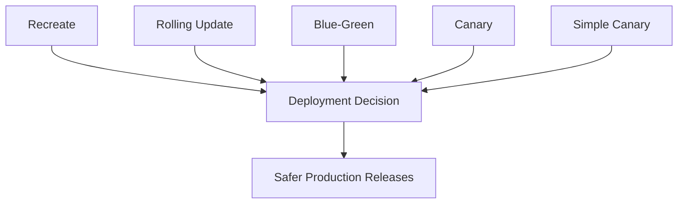

# Deployment Strategies in Kubernetes

This module provides implementation-oriented examples of five core Kubernetes deployment strategies. Each strategy demonstrates a different balance of availability, rollout safety, infrastructure cost, and operational complexity.

## Release Flow Graphic

## Learning Objective
Understand exactly how release behavior changes when you use:
- Recreate
- Rolling Update
- Blue-Green
- Canary
- Simple Canary (intro pattern)

## Prerequisites
- Kubernetes cluster (Kind, Minikube, or managed Kubernetes)
- `kubectl` configured with cluster access
- Optional for local reproducibility: `kind-config.yml` in this folder

## Strategy Index
| Strategy | Primary Goal | Downtime | Complexity | Folder |
| --- | --- | --- | --- | --- |
| Recreate | Clean switch from old to new version | Possible | Low | [Recreate-deployment](./Recreate-deployment/) |
| Rolling Update | Gradual in-place upgrade | Minimal/None | Low-Medium | [Rolling-Update-Deployment](./Rolling-Update-Deployment/) |
| Blue-Green | Zero-downtime cutover with fast rollback | None (if configured correctly) | Medium | [Blue-green-deployment](./Blue-green-deployment/) |
| Canary | Risk-controlled partial rollout | None | Medium-High | [Canary-deployment](./Canary-deployment/) |
| Simple Canary Example | Beginner canary implementation pattern | None | Medium | [Simple-Canary-Example](./Simple-Canary-Example/) |

## Quick Tradeoff View
| Strategy | Safety | Speed | Cost | Complexity |
| --- | --- | --- | --- | --- |
| Recreate | Low | Medium | Low | Low |
| Rolling Update | Medium-High | Medium | Low | Low-Medium |
| Blue-Green | High | High | High | Medium |
| Canary | Very High | Medium | Medium-High | Medium-High |
| Simple Canary | Medium | Medium | Medium | Medium |

## 1. Recreate Strategy
### How it works
- Existing pods are terminated first.
- New version pods are created only after old pods are removed.

### When to use
- Backward-incompatible changes.
- Small internal systems where brief downtime is acceptable.
- Stateful apps that cannot safely run two versions simultaneously.

### Tradeoffs
- Pros: simplest rollout behavior, predictable cutover.
- Cons: downtime risk during replacement window.

### Files
- `recreate-namespace.yml`: isolates resources.
- `recreate-deployment.yml`: deployment workload definition.
- `recreate-svc.yml`: stable service endpoint.
- `README.md`: execution details.

## 2. Rolling Update Strategy
### How it works
- Kubernetes gradually replaces old pods with new pods.
- Service continues routing traffic while rollout progresses.
- Controlled by deployment rollout settings.

### When to use
- Default choice for most stateless web/API services.
- Teams that need safer upgrades without complex traffic management.

### Tradeoffs
- Pros: near-zero downtime, native Kubernetes behavior.
- Cons: rollback/rollout speed depends on pod startup health and update settings.

### Files
- `rolling-namespace.yml`: namespace setup.
- `rolling-update-deployment.yaml`: rolling rollout deployment.
- `rolling-update-svc.yml`: service fronting pods.
- `README.md`: implementation and verification steps.

## 3. Blue-Green Strategy
### How it works
- Two environments exist in parallel:
  - Blue = current stable version
  - Green = new candidate version
- Traffic is switched to green after validation.
- Rollback is quick by routing traffic back to blue.

### When to use
- Production releases requiring safe validation and quick fallback.
- Cases where full environment duplication is acceptable.

### Tradeoffs
- Pros: low-risk releases, instant rollback.
- Cons: higher infrastructure cost due to dual environments.

### Files
- `blue-green-ns.yml`: namespace definition.
- `online-shop-without-footer-blue-deployment.yaml`: blue version resources.
- `online-shop-green-deployment.yaml`: green version resources.
- `README.md`: switch and validation workflow.

## 4. Canary Strategy
### How it works
- New version is released to a small traffic percentage first.
- Stable version continues serving majority traffic.
- Traffic share is increased gradually after monitoring.

### When to use
- High-risk releases where progressive exposure is required.
- Teams with monitoring discipline (latency, error-rate, saturation tracking).

### Tradeoffs
- Pros: strong risk control, real-user validation.
- Cons: higher operational complexity and observability requirements.

### Files
- `canary-namespace.yml`: namespace setup.
- `canary-v1-deployment.yaml`: stable baseline version.
- `canary-v2-deployment.yaml`: canary version.
- `canary-combined-service.yaml`: shared service for both versions.
- `ingress.yaml`: route entry point.
- `README.md`: progressive rollout instructions.

## 5. Simple Canary Example
### How it works
- Demonstrates the canary idea using simpler resources and app pair.
- Useful for understanding traffic behavior before advanced tooling.

### When to use
- Learning canary fundamentals.
- Validating local cluster setup and ingress behavior.

### Files
- `namespace.yaml`: namespace isolation.
- `nginx-configmap.yaml`, `apache-configmap.yaml`: app-specific config.
- `nginx-deployment.yaml`, `apache-deployment.yaml`: two app versions.
- `canary-service.yaml`: service path for traffic routing.
- `ingress.yaml`: external entry route.
- `README.md`: simple walkthrough.

## Supporting Files at Module Root
- `deployment-strategies-comparison.md`: conceptual strategy comparison.
- `kind-config.yml`: local Kind cluster topology for multi-node testing.

## Recommended Learning Path
1. Recreate (baseline behavior)
2. Rolling Update (native upgrade path)
3. Blue-Green (environment cutover)
4. Simple Canary (canary fundamentals)
5. Canary (production-style staged rollout)

## Validation Checklist for Any Strategy
- Deploy resources and confirm pod readiness.
- Verify service reachability.
- Confirm expected traffic behavior during rollout.
- Trigger rollback path and validate recovery.
- Cleanup namespace/cluster resources.
