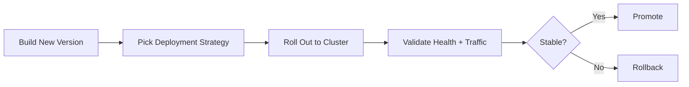

# Kubernetes Deployment Strategies

This repository contains a focused Kubernetes practice module for understanding and implementing modern application release patterns.


## Visual Overview


## What This Project Covers
- Practical deployment strategy examples using Kubernetes manifests.
- Safe rollout concepts such as gradual replacement, traffic shifting, and rollback.
- Real deployment tradeoffs between speed, risk, cost, and availability.

## Why This Is Important
Learning deployment strategies is essential for production Kubernetes operations because release quality is not only about writing code, but also about shipping it safely.

A strong strategy helps teams:
- Reduce or eliminate downtime.
- Limit user impact during failures.
- Validate new versions with controlled exposure.
- Roll back quickly when defects are detected.

## Repository Structure
- [Deployment_Strategies](./Deployment_Strategies/): main module with strategy-specific manifests and documentation.

## Strategy Snapshot
| Strategy | Downtime Risk | Rollback Speed | Infra Cost |
| --- | --- | --- | --- |
| Recreate | High | Medium | Low |
| Rolling Update | Low | Medium | Low |
| Blue-Green | Very Low | Fast | High |
| Canary | Very Low | Fast | Medium-High |

## Who Should Use This
- DevOps engineers preparing for production deployments.
- Platform engineers designing release workflows.
- Developers learning how Kubernetes rollout behavior works in practice.

## Getting Started
```bash
cd Deployment_Strategies
```

Open the module README for detailed strategy explanations, execution flow, and manifest-level guidance.
